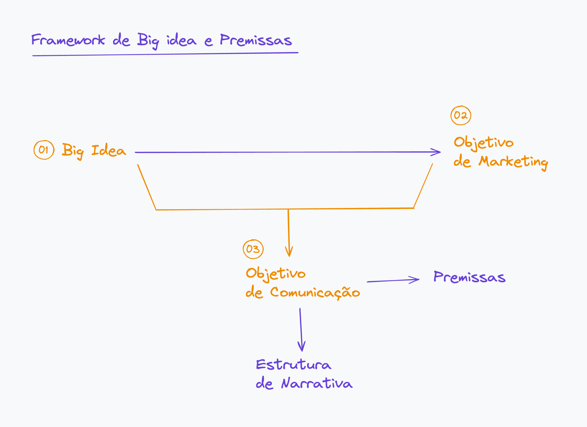
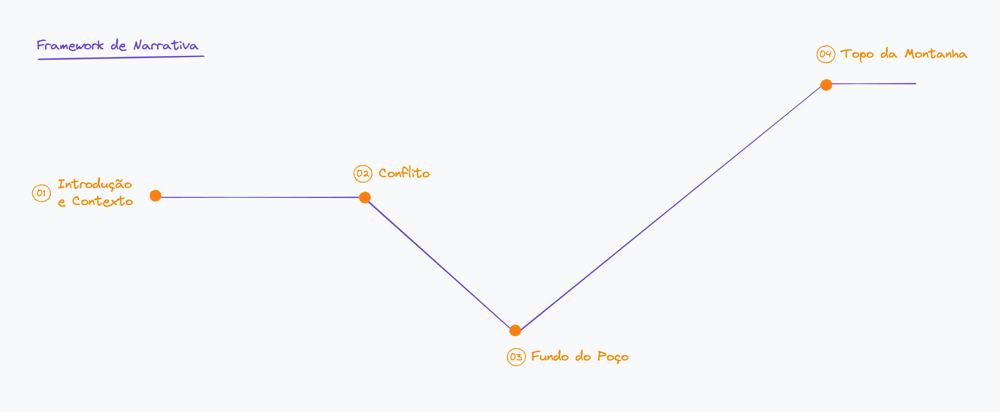
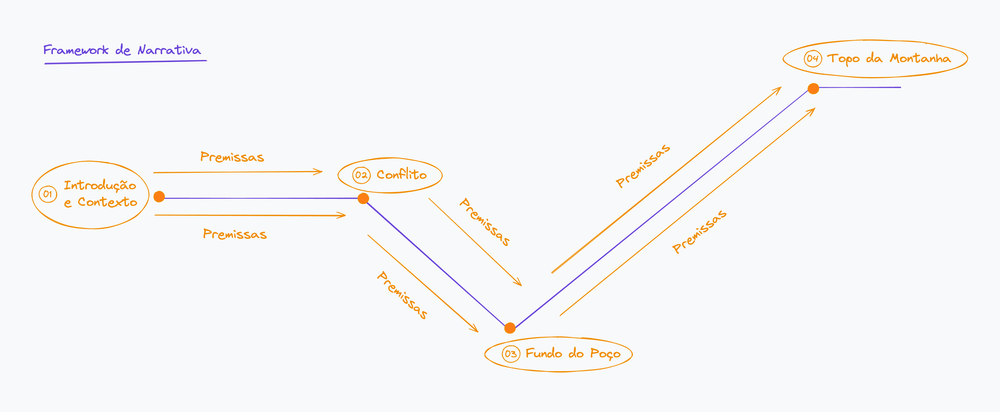
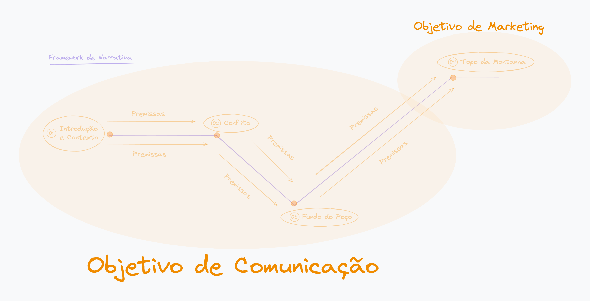

# Playbook de Comunicação

### Estruturas de Narrativas

⚠️ O quarto passo é fundamental para começarmos a dominar **a comunicação com o ICP selecionado.** Nesta etapa falaremos sobre as estruturas de narrativas que podem ser utilizadas nos principais meios de comunicação, bem como, construir narrativas com alto nível de atração, relacionamento e conversão.

### Big Idea e Premissas

⚠️ **O que são Big Ideas?**
É uma forma de condensar uma comunicação, uma narrativa com o ICP selecionado através de elementos comunicativos que geram mais atração, criatividade e direcionamento para sua comunicação.
Big Idea é a base de uma ideia de conteúdo que visa um objetivo de de comunicação e de marketing.

⚠️ **O que são Premissas?**
São fatos e verdades que dentro das estruturas de narrativas que serão entendidos nos próximos passos, ajudarão a compor e empacotar uma comunicação altamente atrativa e altamente conectada com o seu ICP

⚠️ **Big Ideas e Premissas** nunca serão sobre você! E sim sobre seu ICP, o sentimento dele, o cotidiano dele, o que gera conexão com ele.

Todo fluxo de comunicação com o seu ICP, seja essa comunicação através de conteúdos, anúncios ou página, precisam seguir uma estrutura lógica para conseguir atrair, relacionar e converter o seu potencial cliente.

❗ **Atenção:
Trabalhar uma comunicação com Big Idea e Premissas é completamente o contrário de publicidade ou completamente o oposto com a comunicação padrão que o mercado comumente utiliza.
As premissas visam contar histórias através de uma identificação forte do seu ICP, gerar conexão através dos sentimentos intrínsecos em seu ICP.**

### Framework de Big Idea e Premissas

⚠️ Esse framework é um processo sistêmico para que você possa entender de maneira lógica como pensar e elaborar uma comunicação mais assertiva.

Framework de big ideas e premissas.png

1. Tudo começa com uma grande ideia de comunicação e ela vai ser direcionada para algum objetivo de marketing (Se existe uma comunicação a ser feita, precisa de um objetivo).
2. Os objetivos de marketing podem ser diversos, trazendo para o que é essencial hoje no mercado, podemos citar:
    - Conquistar seguidores
    - Vender seus produtos ou serviços
    - Receber visitas em seu site
3. Uma vez que você tem um objetivo de marketing bem traçado, será necessário que você tenha um objetivo de comunicação.
    1. O objetivo de comunicação é composto pelo [Framework de Narrativa](https://www.notion.so/e639960b32f84e8583449cd6e5a18eb1?pvs=21) e pelas Premissas.

### Framework de Narrativa

⚠️ Esse framework é um processo sistêmico para que você possa entender de maneira lógica como desenvolver uma narrativa centrada na conexão e aterrissagem do seu ICP.

framkework-narrativa.png

1. Toda narrativa começa com uma introdução e um contexto bem estruturado em uma comunicação
2. O fluxo comunicativo precisa apresentar os conflitos que geram conexão com o ICP
3. Os conflitos jogam o ICP para o fundo do poço onde realçamos os problemas e urgências ocultas
4. Ele começa a escalada da solução para alcançar o topo da montanha

frameworkpremissas.png

1. São as premissas que direcionam a comunicação entre os elementos narrativos.

E todo esse processo acaba estruturando uma comunicação assertiva para o seu ICP, agregando o framework de big idea e premissas com o framework de narrativas.

frameworkmerged.png

### Estrutura Essencial de Big Ideas

⚠️ Para que uma Big Idea possa ser bem estruturada, existe um checklist que te ajuda a ter ideias de comunicações mais assertivas e direcionadas para o seu ICP.

→ Todo produto/serviço precisa ter uma big idea central, ou seja, uma frase que pondera exatamente o que você entrega.

👉 **Exemplo:** Se eu ofereço plataforma com análise de dados e inteligência artificial para infoprodutores, minha big idea central será: **Inteligência Artificial para Gerar Mais Resultados para Infoprodutores.**
Essa big idea central é o fato principal que pauta a sua entrega.

→ Big Idea não tem senso lógico (é maluco mesmo, é fora da casinha).

👉 **Exemplo:** A big idea do MorumBIS! Não foi lógica! Foi utilizado o conceito de trocadilho para gerar o naming rigths do estádio do Morumbi.
**Big Idea geralmente utiliza seus instintos mais criativos.**

→ Uma big idea precisa abrir um leque de várias outras big ideas.

👉 **Exemplo:** Um infoprodutor que utiliza PDF na venda do curso dele, podemos ter várias ideias de big ideas:
• O teu curso vai morrer com PDF!
• Por que o PDF atrasa seu resultado?
• Como o PDF desacelera sua operação?
• Como o PDF deixa moroso o crescimento do seu produto?
• Como um PDF é algo antigo?
• Como um PDF faz seu curso ter prazo de validade?
São ideas que fogem do padrão de comunicação e abre um leque de criatividade para você abordar esses temas.
Uma big idea muito boa, geralmente abre leque para várias outras.

- • O teu curso vai morrer com PDF!
- • Por que o PDF atrasa seu resultado?
- • Como o PDF desacelera sua operação?
- • Como o PDF deixa moroso o crescimento do seu produto?
- • Como um PDF é algo antigo?
- • Como um PDF faz seu curso ter prazo de validade?

→ Uma big idea precisa ter uma variedade de estímulos.

👉 As big ideas podem ser irônicas, sarcásticas, emocionais, racionais e vários outros estímulos.

→ Uma big idea pode ser formal, engraçada ou reflexiva.

👉 As big ideas podem beirar a formalidade, podem ser engraçadas (e essas são as mais utilizadas no meu publicitário) e podem ser mais reflexivas pelo ponto de vista da audiência.

→ Uma big idea não precisa ser visível para sua audiência.

👉 As big ideas estarão sempre intrínseca no conteúdo, ela não é visível, não é anunciada. A própria comunicação será capaz de identificar a grande ideia por trás.

→ Big idea = Criatividade sem limites

👉 Big ideas devem usar todo o tipo de criatividade possível, desde que, o contexto comunicativo faça sentido.
Big ideas exigem que **você** **não tenha preciosismo com a ideia e você precisa correr riscos.**

### Estrutura Essencial de Premissas

⚠️ Para que uma comunicação seja assertiva por completa, precisamos além da big idea entender como utilizar as premissas dentro de uma estrutura lógica e sistemática.

### Elementos das Premissas

- Devem parecer algo inocente
    
    👉 É uma conversa, algo leve, batendo papo, trocando ideia…
    
- Não tem gatilhos mentais padrões
    
    👉 Não tem escassez, não tem autoridade e nenhum outro gatilho padrão de mercado.
    Ela precisa parecer uma conversa e não subestimar a inteligência da audiência.
    **Exemplo:** Você está cansado de…? Quer aprender a….? Esse tipo de comunicação deixa claro que você vai vender e isso é subestimar a inteligência da audiência.
    Todos estão na internet para vender alguma coisa e sua audiência sabe disso!
    
- Precisa ser leve e densa
    
    👉 Você precisa ser leve na comunicação e criar uma conversa densa com sua audiência, chamando a atenção dele com as premissas.
    Seja franco, tenha um papo aberto e verdadeiro com sua audiência usando um pouco do humor, do sarcasmo, do exagero, do irônico para apresentar a comunicação.
    Você não está (e não deve) mentir para sua audiência…
    **Exemplo:** Nós somos a melhor software-house do Brasil… **Como assim são os melhores? Quem falou que vocês são os melhores? Quem disse que você é o melhor?**
    Não mente para sua audiência…
    
- Seja bom, sem ser marketeiro
    
    👉 Clique agora, compre agora, faça agora, último lote, últimos dias…
    Esquece esses gatilhos, isso cansa a audiência e não gera resultado.
    
- Tudo o que parece publicidade é invisível
    
    👉 Ninguém quer comprar nada nas redes sociais, pareceu que quer vender? Ninguém vai querer comprar
    A ideia das premissas é tentar converter através das histórias e da conexão com seu ICP.
    Sem parecer ser chato, sem empurrar goela abaixo uma venda que teu ICP não quer.
    
- Uma boa copy é cortar tudo o que é ruim
    
    👉 Não será a primeira copy que ficará boa, principalmente se você usa o GPT para criar copys.
    GPT não possui contexto, não improvisa e não arrisca.
    Copy boa é a que usa o cérebro, copy boa é a que você treina, testa e valida o tempo inteiro cortando o que não precisa ter.
    **Exemplo:** Se estou falando de PDF em uma big idea, eu não preciso falar de excel.
    
- A melhor copy vem da observação do cotidiano
    
    👉 A pesquisa e o levantamento efetuados na definição do ICP, suas dualidades, desejos e soluções do seu ICP é o ponto primordial para você conseguir construir uma boa copy.
    Por isso a primeira etapa é fundamental para que a comunicação tenha sentido.
    
- Nunca comece com uma promessa
    
    👉 Não comece jamais uma comunicação com uma promessa. Da porta para fora você usa premissa, da porta para dentro (quando você realmente precisar vender para o seu cliente) você usa uma promessa.
    Comunicação da porta para fora (conteúdos, anúncios e páginas de captura) precisam usar premissas.
    
- Precisam ajudar a chegar no objetivo
    
    👉 As premissas te ajudam a chegar no objetivo de marketing traçado, se você não tem um objetivo claro, sua comunicação também não será.
    
- Premissa não significa quebrar o padrão em excesso
    
    👉 A quebra de padrão é bem-vinda desde que esteja dentro da proposta da Big idea.
    
- Premissa precisa de uma conclusão lógica
    
    👉 Toda comunicação precisa ter uma comunicação lógica, com começo, meio e fim concisos.
    

### Exemplos Aplicados

⚠️ Os exemplos abaixo servem para elucidar a utilização de premissas fracas e como podemos utilizar big ideas e as premissas fortes para conseguir um resultado de comunicação melhor.

### Premissas Fracas x Premissas Fortes

- “Nós fazemos software de qualidade…”
    
    ❗ Qualquer pessoa que vende software vai falar que vende software de qualidade, não há nada surpreendente nessa premissa fraca.
    Eu não diria nem que é uma premissa, mas sim, uma promessa.
    Até o cliente pode te questionar se você faz mesmo, afinal, todos falam que fazem.
    
    Para essa comunicação eu poderia utilizar a seguinte estrutura:
    
    👉 **Big Idea:** A maioria dos softwares são ruins…
    
    👉 **Premissa:** Travamentos, bugs e windows 98. A maioria dos softwares empresariais parecem ter sido desenvolvidos com o T-rex sendo supervisor.
    *Perceba que temos um começo forte, falando exatamente dos problemas que esse potencial ICP pode estar enfrentando. Travamentos, falhar e utilizar um layout que não gera nenhuma experiência boa de usabilidade. Nessa comunicação usamos o bom humor para trazer uma afirmação de que o software é antigo e ultrapassado.*
    
- “Desenvolvemos soluções tecnológicas…”
    
    ❗
    Se você usa tecnologia para desenvolver essa comunicação é meio que óbvia, não precisa isso ser reforçado.
    Usar esse tipo de comunicação pode atrair o ICP errado gastando seu tempo e energia em quem não vai pagar o valor que você espera.
    Afinal, sua comunicação genérica vai atrair um ICP genérico.
    
    Para essa comunicação eu poderia utilizar a seguinte estrutura:
    
    👉 **Big Idea:** Investimento errado e tempo perdido.
    
    👉 **Premissa:** Muitas empresas querem ter um software para resolver algum problema, mas é impressionante como a maioria fazem escolhas erradas.
    *Perceba que temos um começo forte, usando um fato que empresas realmente querer um software para resolver problemas, porém, na sequência eu já trago outro fato e afirmação de que, provavelmente eles farão, ou já fizeram uma escolha de desenvolvedor errado, uma escolha de software-house que não vai entregar 20% do que eles precisam.*
    
- “Ajudo seu negócio a crescer com nosso software…”
    
    ❗ Mais um exemplo muito utilizado que representa uma falta de profundidade na comunicação. Quanto mais genérico, menos eficiente você será.
    
    Para essa comunicação eu poderia utilizar a seguinte estrutura:
    
    👉 **Big Idea:** Modinha de software!
    
    👉 **Premissa:** Com certeza você vai escolher a solução errada para resolver um problema que não existe.
    *Perceba que temos um começo forte, usando uma urgência oculta onde empresas desenvolvem soluções que não resolvem absolutamente nada para ninguém.*
    
- “Tecnologia avançada para todos…”
    
    ❗ Mais um exemplo genérico que afeta o seu posicionamento e sua estratégia de captação. Se a premissa já é fraca, todo o restante da sua comunicação também será.
    
    Para essa comunicação eu poderia utilizar a seguinte estrutura:
    
    👉 **Big Idea:** Você não é todo mundo…
    
    👉 **Premissa:** Dizem por aí que todo mundo precisa de tecnologia para resolver algum problema, mas como minha mãe sempre me dizia: você não é todo mundo!
    *Perceba que temos um começo forte, usando a curiosidade que existe em cada ser humano, ligando o alerta para a continuidade da mensagem e para a sequência, utilizando o humor através de algo cultural nos brasileiros.
    O poder da mensagem vai gerar um contra-ponto no ICP dando a ele o poder da dúvida: será que você precisa de tecnologia? de software?
    Desta forma, durante a comunicação eu posso comprovar que ele realmente precisa.*
    
- “Soluções inovadores em TI…”
    
    ❗ Imagine o tamanho desse guarda-chuva: “soluções em TI”. É muito amplo, macro, aberto demais. Existem muitas coisas que pode arremeter a soluções em TI, então, não existe qualquer possibilidade de gerar um resultado maior e satisfatório em sua comunicação.
    
    Para essa comunicação eu poderia utilizar a seguinte estrutura:
    
    👉 **Big Idea:** A IA vai tomar o seu lugar…
    
    👉 **Premissa:** Eu não tenho medo da IA tomar o meu lugar no mercado, mas eu tenho medo da IA tomar o seu…
    *Perceba que temos um começo forte, usando uma afirmação intrínseca no que eu acredito, ou seja, crenças sempre geram debates. E para a sequência nós trazemos um assunto de atualidade levantando um alerta para o ICP.
    Se ele não olhar para a IA e começar a se mover, implementar e utilizar IA nos seus negócios, a IA tomará o lugar dele.
    Na sequência da comunicação podemos nos aprofundar na importância da IA para a operação do ICP.*
    

👉 **Premissas Fracas:** Tendem a ser pretenciosas, desinteressantes, contestáveis e complexas.

👉 **Premissas Fortes:** Tendem a ser exageradas, despretenciosas, curiosas, incontestáveis e simples.

### Estruturas Essenciais de Comunicação

⚠️ As estruturas essenciais de comunicação utilizam um checklist simples que te ajuda a entender o que não pode faltar na sua comunicação com premissas

- [ ]  Tem que ter um início forte
- [ ]  Não pode estar no imperativo (Aprenda, Faça, Transforme…)
- [ ]  Deve conter ativação do racional
- [ ]  Deve conter ativação do emocional
- [ ]  Devem levar a decisão que você quer (Objetivo de Marketing)
- [ ]  Toda comunicação deve conter um título
- [ ]  Toda comunicação deve conter uma big idea
- [ ]  Toda comunicação deve conter um formato
- [ ]  Toda comunicação deve conter um objetivo comunicativo
- [ ]  Toda comunicação deve conter um objetivo de marketing

### Elementos de Premissas

→ Escalada de Atenção

👉 Construir uma comunicação da qual uma pessoa queira continuar lendo. Esse processo só existe por causa da “Escalada de Atenção”.
Quando uma comunicação utiliza um início forte, que quebra o padrão no início, precisa ter essa comunicação sustentada por uma atenção que deve subir cada vez mais em sua comunidade.

→ Ironia, Sarcasmo ou Deboche

👉 Esse elemento deve ser usado com cuidado e vale muito a pena você pensar um pouco no impacto que pode ser gerado ao usá-lo.
Ironia é algo arriscado, porque tem gente que pode não entender e se sentir ofendido. **Recomendo que você se arrisque um pouco de vez em quando..**
Imagine que existe um muro com dois lados, o lado do senso comum e o lado do arriscado. Você precisa andar em cima do muro e se tiver que escorregar um pouco, que seja do lado arriscado. **Afinal, todo estão no lado do senso comum.**

→ Crônica

👉 Esse elemento não tem a menor intenção de vender. Ela tem a intenção de passar uma ideia, uma mensagem e principalmente um valor.
Uma crônica bem feita possui detalhes bem específicos sobre o que você está escrevendo.
**Exemplo:** “Nosso relacionamento está fracassado…”
É muito vago, precisa de mais detalhes: “Faz tempo que você não me olha nos olhos, não fiz que me ama e quase não me toca mais…””
A crônica traz muito valor, porque as pessoas não só compram, mas começam a compartilhar os mesmos valores. Além disso, uma crônica bem feita atrai o tipo de cliente que você está buscando.
Será que meu cliente é o cara que quer ostentar? Ou é o cara da família? Ou é o cara que quer curtir a vida? A crônica te faz encontrar o seu público.

→ Super Sincero

👉 Já aconteceu de você estar em um elevador e alguém solta uma bufa? Todos sabem o que está acontecendo ali e não veem a hora da porta abrir, só que tem um cara que se manifesta:
“Jesus, gente… Alguém aqui está podre por dentro!”
Esse é um cara super sincero. Enquanto todos tentam disfarçar ou só querem sair depressa do lugar, esse cara verbaliza a insatisfação, na maioria das vezes de forma engraçada. Vez ou outra alguém se manifesta mais bravo.
Engraçado ou bravo, para usar esse elemento você precisa ser esse cara, o super sincero.

→ Sentir na Pele

👉 “Quando eu comecei a vender software eu tinha uma dificuldade muito grande de falar com o potencial cliente, dava até dor no estômago.
Quando eu mandava mensagem no whatsapp e marcava a reunião com a lead, eu já ficava ansioso mesmo que a reunião fosse na próxima semana, ou seja, sete dias depois.
Cada dia que passava, eu evitava olhar o calendário, porque o medo que eu tinha de falar o que não sabia era muito grande…“”
Eu realmente vivi isso na pele. Teve época que eu tinha um pico de ansiedade enorme simplesmente por não saber e não ter a segurança em conversar com um potencial cliente.
A premissa aqui é muito clara: “Sentir ansiedade antes de falar com o potencial cliente não vai adiantar nada…””
Isso incomoda e esse é exatamente o objetivo de uma boa copy, incomodar.

→ Superstição

👉 As pessoas são altamente supersticiosas, inclusive os que dizem que não são.
Quando eu falo a frase: “Eu acredito que você vai vender muito software ainda…”, estou mexendo com algo muito importante das pessoas: a fé.
As pessoas começam a querer mais.

→ Sempre que, então

👉 Esse elemento serve para criar uma âncora.
Sempre que (algo do cotidiano acontecer), então (lembre do problema e do método).
Isso ajuda as pessoas lembrarem que tem que resolver o problema várias vezes por dia.

→ Linguagem Fantasiosa

👉 Esse elemento serve para usar o lúdico, o fantasioso para se comunicar.
**Exemplo: “**Vendi um software falido.
Meu cliente me pediu um software unicórnio que ganharia milhões e o deixaria extremamente milionário, mas eu só consegui vender pra ele um software falido que vai mendigar alguns trocados quando for lançado.
*Imagine que na continuidade dessa comunicação, eu posso continuar usando essa linguagem fantasiosa do falido para representar a venda de um software que começará no mercado em qualquer ganho.*
Esse tipo de copy é envolvente, as pessoas sentem vontade de compartilhar, é uma brincadeira legal, tem uma piadinha em um lugar ou outro e fica bem interessante.

→ Criação de Personagem

👉 Quanto mais diferente, esquisito ou fora do normal for o seu cliente, melhor o personagem que você pode criar.
→ Um cliente que é muito detalhista nos pedidos, pode ser um bom personagem.
→ Um cliente que é muito seco na comunicação, pode ser um bom personagem.
→ Um cliente que é muito energético, pode ser um bom personagem.
Lembre-se que, esse tipo de linguagem com criação de personagem não visa enganar ninguém, mas sim, usar a representação real de o perfil de alguém que sem dúvida sua audiência vai se conectar.

→ Metáfora

👉 Usar metáforas e analogias é um formato de comunicação muito atrativo.
***→ Vender software é igual plantar um pé de laranja!** (Nessa comunicação eu vou usar metáforas e fazer uma analogia do processo da venda de software com o processo de plantar um pé de laranja).*

→ Comunidade

👉 Usar sua própria audiência, as causas dela e o que ela defende pode ser um grande trunfo.
O elemento de comunidade precisa reforçar algo maior do que você ou seu produto. É uma causa que gera engajamento e conexão com sua audiência.

→ Impacto Visual

👉 Imagina você colocar duas plataformas em um conteúdo de comparação. De um lado da tela uma plataforma com design impecável, usabilidade incrível e uma identidade visual bem profissional.
Do outro lado uma plataforma mais simples em design, usabilidade bem enxuta mas funcional e quase nenhuma identidade visual.
Agora imagine um título com cifrão de dinheiro e o valor R$ 1 milhão de reais é o que essa plataforma gerou….
Com certeza, no senso comum, a mente da audiência vai acreditar que o design bonito é o responsável, mas a ideia é ser completamente o oposto.
O impacto visual aqui nesse exemplo é mostrar que um MVP simples e sem preciosismo foi capaz de faturar mais que um MVP cheio de detalhes.

→ Setup + Punch

👉 O Setup é a preparação que você precisa fazer para chegar em uma conclusão, que é o Punch.
É quando você cria um contexto e em seguida quebra com uma invertida.
Setup e Punch não necessariamente precisam ser cômicos. Às vezes o Punch é engraçado e às vezes é apenas uma invertida.

→ Antítese

👉 Esse elemento é uma figura de pensamento que acontece por meio da aproximação de palavras com sentidos opostos, por exemplo:
“O ódio e o amor andam de mãos dadas.”
As figuras de linguagem são recursos que buscam dar mais ênfase, destaque ou expressividade ao texto.

→ Afegão Médio

👉 Afegão Médio é o povo comum. O que o afegão médio quer na vida dele?
Ele quer pouco. Ele quer a picanha no fim de semana, a cervejinha… Às vezes ele não quer algo muito mirabolante.

⚠️ Todos os elementos de premissas abaixo foram aprendidos por mim e são aplicados seguindo todo o direcionamento do ***Leandro Ladeira (meu mentor e um dos maiores players do mercado digital no Brasil)*.**
Mais especificamente do produto: **Light Copy** **do Ladeira**

*Recomendo não apenas esse produto, mas qualquer outro produto do Ladeira como o Venda Todo Santo Dia, Stories 10x e Mentoria Fluxo.*

### Comunicação

⚠️ Abaixo você poderá entender como criar uma comunicação dentro de estruturas básicas aplicando os processos e estruturas de narrativas essenciais para atração, relacionamento e conversão.

❗ Para a estrutura de comunicação, recomendo que você crie o hábito de escrever, testar os elementos comunicativos e treine o teu cérebro na escrita. Esse processo te ajuda a ser mais criativo e dominar o jogo de palavras que é fundamental para atrair o teu ICP.

### Gatilhos de Engajamento

- Combustível Extra
    
    👉 **Lógica do Gatilho:** A ideia desse dispositivo é trazer audiência de outro lugar para o stories: Evento, live, e-mail,Telegram, WhatsApp.
    **Exemplo de execução:**
    “Hoje eu vou dar uma verdadeira aula sobre anúncios com quebra de padrão nos stories. Você vai me falar seu nicho e eu vou criar um anúncio para você”
    
- Desafio Curto com Promessa de Análise
    
    👉 **Lógica do Gatilho:** Propor um desafio para audiência prometendo uma promessa de análise. Assim você incentiva a interação por inbox, e cria uma necessidade das pessoas ficarem atentas ao seu perfil ao longo do dia.
    **Exemplo de execução:**
    “Me envia por inbox sua página de vendas que eu vou fazer uma análise”
    
- Conversa sem Privacidade
    
    👉 **Lógica do Gatilho:** Responder à conversa do inbox nos stories. Mostrar um trecho de uma conversa do inbox é uma das melhores maneiras de incentivar que mais pessoas venham falar com você.
    **Exemplo de execução:**
    Tirar print de uma conversa e postar nos stories com um comentário.
    
- Dia do Hotseat
    
    👉 **Lógica do Gatilho:** Pedir para audiência contribuir com conteúdo. Fazendo isso você terceiriza a geração de conteúdo para audiência e ainda incentiva a interação e contribuição.
    **Exemplo de execução:**
    “O que vocês acham que tem de errado nessa página de vendas? Me manda por inbox”
    
- Meta Coletiva
    
    👉 **Lógica do Gatilho:** Estipular uma meta para entregar algum benefício. Essa é uma maneira de aumentar muito as interações e engajamento com sua audiência.
    **Exemplo de execução:**
    “Se esse storie bater 500 compartilhamentos eu vou […]”
    
- História com Gancho
    
    👉 **Lógica do Gatilho:** Contar uma história que gere contexto para uma ação que você quer que o público realize. Assim você deixa sua audiência interessada em consumir seus conteúdos da sequência e mais instigada em realizar a ação final.
    **Exemplo de execução:**
    “Hoje eu vou contar a história do dia que eu […].
    
- Cultura de Resultado
    
    👉 **Lógica do Gatilho:** Incentivar audiência a mostrar os resultados que têm. Criando essa cultura, as pessoas vão associar que seu produto é eficiente em gerar resultado, além de você conseguir provas para vender.
    **Exemplo de execução:**
    Eu faço isso incentivando que me mandem prints de faturamento.
    
- Piada Interna
    
    👉 **Lógica do Gatilho:** Criar uma piada interna através da repetição. Assim sua audiência se sente inteligente por reconhecer a piada e se sente incluída no grupo, aumentando sua conexão com o público.
    **Exemplo de execução:**
    Fazer repetições de uma piada.
    
- Pânico pelo Conteúdo
    
    👉 **Lógica do Gatilho:** Gerar uma forte antecipação pelo seu conteúdo através da curiosidade. Fazendo isso você ganha a atenção e interesse da sua audiência, que vai consumir seu conteúdo com muito mais presença.
    **Exemplo de execução:**
    “Eu vou revelar um dos dispositivos que mais me traz vendas hoje à meia-noite”
    
- Ansiedade pela Abertura
    
    👉 **Lógica do Gatilho:** Incentivar audiência a mandar um comprovante de que realizaram uma ação. Assim, quem ainda não realizou a ação que você quer, percebe que está ficando de fora e a tendência é que ela realize também.
    **Exemplo de execução:**
    “Se você já comprou o ingresso, manda aqui para eu saber quem vai”
    
- Abertura de Carrinho
    
    👉 **Lógica do Gatilho:** Gerar antecipação pela abertura de carrinho. Ao fazer isso você aumenta o público consciente do horário e dia da abertura do seu carrinho, e aumenta muito a quantidade de pessoas que vai ver sua página de vendas.
    **Exemplo de execução:**
    “Amanhã às 9 horas eu vou abrir às vendas para […]”
    
- Ative a Notificação
    
    👉 **Lógica do Gatilho:** Gerar expectativa por um conteúdo que você fará. Essa é uma maneira de aumentar muito as visualizações no dia que você for realizar os Stories 10x.
    **Exemplo de execução:**
    “Amanhã eu vou falar sobre[…]”
    
- Alerta para Voltar
    
    👉 **Lógica do Gatilho:** Fazer um convite para o público voltar os Stories. Com essa interação, o algoritmo do Instagram entende que seu conteúdo tem algo de valor e seu engajamento aumenta. Além de você entender o que funciona melhor para audiência.
    **Exemplo de execução:**
    “Volta os stories e me manda um emoji no que mais fez sentido para você”
    
- BI Apurado
    
    👉 **Lógica do Gatilho:** Realizar uma pesquisa com a audiência. Essa é uma maneira de receber muitas informações valiosas a respeito da sua audiência, que você pode utilizar para vender, criar ou melhorar seu produto.
    **Exemplo de execução:**
    “Me conta o porque você comprou o […]”
    
- Print Valioso
    
    👉 **Lógica do Gatilho:** Incentivar sua audiência a tirar print. Quando alguém tira print dos seus Stories, isso conta muito para o Instagram, e o resultado é que sua entrega e engajamento aumentam muito.
    **Exemplo de execução:**
    “Aproveita para tirar print do que gerou valor para você”
    
- Identidade do Comunicador
    
    👉 **Lógica do Gatilho:** Demonstrar a sua identidade do comunicador. Exagerar suas características naturais é uma das melhores maneiras de manter sua personalidade na mente das pessoas, a consequência é que as pessoas lembram mais de você.
    **Exemplo de execução:**
    Exagerar suas características naturais em momentos oportunos.
    
- Identidade de Produto
    
    👉 **Lógica do Gatilho:** Demonstrar a identidade do seu produto. Essa é uma maneira de deixar a identidade do seu produto na mente das pessoas, assim as chances de você fazer vendas aumentam.
    **Exemplo de execução:**
    Mostrar respostas em que as pessoas falam de aspectos exclusivos do seu produto.
    
- Identidade do Consumidor
    
    👉 **Lógica do Gatilho:** Dar voz para o seu consumidor ideal. Assim você cria na sua comunidade a percepção do cliente ideal e incentiva um comportamento positivo nos seus seguidores.
    **Exemplo de execução:**
    Quando ver uma atitude que valorize em um cliente, exalte ela nos stories.
    
- Desabafo
    
    👉 **Lógica do Gatilho:** Estimular seu público a desabafar. Toda comunidade tem algo entalado na garganta, se você estimula esse diálogo sua interação e conexão com a audiência aumentam muito.
    **Exemplo de execução:**
    “Você já teve uma experiência ruim com[…]? Me conta aqui”
    
- Opinião de Quem Comprou
    
    👉 **Lógica do Gatilho:** Pedir a opinião de quem comprou. Essa é uma maneira de conseguir informações valiosas a respeito da qualidade de seu produto e ganhar alguns depoimentos.
    **Exemplo de execução:**
    “Se você comprou o seu produto, me fala o que você achou […]”
    
- Peça Compartilhamento
    
    👉 **Lógica do Gatilho:** Incentivar seu público a compartilhar seu conteúdo. Utilizar esse dispositivo aumenta sua base de seguidores, trazendo pessoas novas para conhecer e comprar seu produto.
    **Exemplo de execução:**
    “Se você achou esse conteúdo bom e quer ver esse Instagram maior, compartilhe com seus amigos”
    
- Nomes Esquisitos
    
    👉 **Lógica do Gatilho:** Utilizar nomes próprios na sua comunicação. Utilizar nomes próprios te ajuda a sair do conteúdo “mais do mesmo” e faz seu público se envolver e criar uma identificação muito maior com você.
    **Exemplo de execução:**
    “Utilize a técnica do mortal carpado para […]”
    
- Espetacularização
    
    👉 **Lógica do Gatilho:** Exaltar determinada ação. Exaltando algum acontecimento do seu dia, você aumenta a retenção do público e traz valor para a ação que você está fazendo.
    **Exemplo de execução:**
    Mostrar de uma maneira especial algo que aconteceu com você.
    
- Você Sabia
    
    👉 **Lógica do Gatilho:** Gerar curiosidade com um fato interessante. Trazer um fato interessante para sua audiência é uma das melhores maneiras de gerar curiosidade e interesse pelo seu conteúdo.
    **Exemplo de execução:**
    “Você sabia que 90% da população brasileira […]”
    
- Micro Influência
    
    👉 **Lógica do Gatilho:** Recomendar algo para audiência. Recomendar livros, filmes, séries, até hobbies é uma das melhores maneiras de exercer influência e fazer as pessoas lembrarem de você.
    **Exemplo de execução:**
    “Qualquer pessoa deveria assistir o filme […]”
    
- Presente Difícil
    
    👉 **Lógica do Gatilho:** Oferecer um presente para quem engaja. Essa é uma maneira de incentivar qualquer ação que você queira que a sua audiência faça.
    **Exemplo de execução:**
    “Quem fizer isso vai ganhar […]”
    
- Elemento Escondido
    
    👉 **Lógica do Gatilho:** Falar que tem uma resposta escondida na sua sequência. Quando você fala para alguém que acompanhou sua sequência inteira que tem algo escondido nos stories, as pessoas voltam para procurar. E isso aumenta seu engajamento.
    **Exemplo de execução:**
    “Você percebeu a resposta escondida que eu deixei nos últimos stories?”
    
- Tarja de Curiosidade
    
    👉 **Lógica do Gatilho:** Esconder a parte importante de uma mensagem. Esse dispositivo vai deixar sua audiência sedenta por saber o conteúdo que você escondeu, consequentemente, seu engajamento e interação explodem.
    **Exemplo de execução:**
    “Rafa, eu fiz 50 mil reais utilizando o @#$%*”
    
- Psicologia Reversa
    
    👉 **Lógica do Gatilho:** Dar uma resposta contra intuitiva. Fazer isso quebra completamente a expectativa da audiência, e no fim, você ainda tem chance de fazer uma venda.
    **Exemplo de execução:**
    “Rafa, tô doido para comprar seu curso, você acha que eu consigo? R: Não compre, porque nem é um curso […]”
    
- Resumo
    
    👉 **Lógica do Gatilho:** Pedir um resumo do seu conteúdo. Esse dispositivo incentiva seu público a consumir seu conteúdo de uma maneira muito mais presente, e ainda gera material para sua audiência.
    **Exemplo de execução:**
    “O melhor resumo da Live vai ganhar […]”
    
- 7 Erros
    
    👉 **Lógica do Gatilho:** Pedir para encontrar o erro. Todo mundo quer mostrar que tem valor diante do líder de uma comunidade, esse dispositivo incentiva as pessoas a demonstrarem isso, na prática, te mandando mensagens com os erros.
    **Exemplo de execução:**
    “Nessa página de vendas tem apenas um erro, você conseguiu identificar? Me manda no inbox* …”
    
- Diário
    
    👉 **Lógica do Gatilho:** Fazer um diário de algum momento. Explicar seus sentimentos, observações, e experiências de um dia especial te ajuda a criar muita conexão com sua audiência.
    **Exemplo de execução:**
    Fazer um diário do seu dia de natal, ano novo, aniversário, etc.
    
- Crítica
    
    👉 **Lógica do Gatilho:** Deixar uma deixa para crítica. As pessoas adoram falar sua opinião, geralmente a interação aumenta quando você pede para os seguidores fazerem uma crítica.
    **Exemplo de execução:**
    “O que você diria para esse sujeito[…]?”
    
- Demonstração Curta
    
    👉 **Lógica do Gatilho:** Mostrar como a sua solução pode ser boa para o seu público, demonstrando o benefício de um dos entregáveis do seu produto na prática. Existem várias maneiras de convencer uma pessoa de que seu produto cumpre o que ele se propõe a fazer. Uma das melhores maneiras de fazer isso é com uma demonstração. Por isso esse dispositivo funciona tanto. A lógica deste dispositivo é simples: demonstrar o seu produto funcionando na prática, através da experiência real.
    **Exemplo de execução:**
                1. O Rafa tem o Desafio 30k. Um dos entregáveis dele é o InovaLearn. Uma demonstração prática poderia ser o app funcionando na prática, por exemplo, pode ser um vídeo de 30 segundos em que há uma pessoa criando um planejamento do zero com a tecnologia do App.
                2. Outro exemplo: a Fulana tem um curso de emagrecimento. Um dos entregáveis é um suco detox.
    
                    1. Pode ser um vídeo rápido de uma aluna que fez o suco detox por um mês e perdeu 5 quilos.
    
    1. 1. O Rafa tem o Desafio 30k. Um dos entregáveis dele é o InovaLearn. Uma demonstração prática poderia ser o app funcionando na prática, por exemplo, pode ser um vídeo de 30 segundos em que há uma pessoa criando um planejamento do zero com a tecnologia do App.
    2. 2. Outro exemplo: a Fulana tem um curso de emagrecimento. Um dos entregáveis é um suco detox.
        1. 1. Pode ser um vídeo rápido de uma aluna que fez o suco detox por um mês e perdeu 5 quilos.
- Enquete com Curiosidade Real
    
    👉 **Lógica do Gatilho:** Pense em perguntas que o público todo tem curiosidade em saber e que você possa usar para atrelar ao que você quer vender.
    **Exemplo de execução:**
    Você pode usar a enquete para saber quais são as pessoas mais propensas que precisam da sua ajuda.
    
- Link Oculto
    
    👉 **Lógica do Gatilho:** Colocar o link do produto / serviço que você quer vender no Storie com um nome chamativo no link.
    **Exemplo de execução:**
    “Não seja curioso - clique aqui”
    
- Indicação Pretenciosa
    
    👉 **Lógica do Gatilho:** Pedir para os seguidores enviarem indicações. As pessoas amam dar indicações, principalmente quando você é líder de uma comunidade, fazendo isso você aumenta muito a interação com a sua audiência.
    **Exemplo de execução:**
    “Queria assistir um filme bom hoje a noite. Você conhece algum?”
    
- Levante a Mão
    
    👉 **Lógica do Gatilho:** É uma maneira de fazer uma “triagem” no seu público. Ou seja, fazer um processo de separação para achar as pessoas mais interessadas em comprar de você. Entre seus seguidores, existem desde as pessoas que ainda não estão muito conscientes de seu produto (a maioria). E existem as pessoas que já estão conscientes do seu produto, e que já poderiam comprar de você. Esse dispositivo te ajuda a gastar energia pegando os frutos mais maduros e pertos do chão (pessoas prontas para comprar de você). Assim você não perde tempo com os frutos verdes e do topo da árvore (as pessoas que ainda não estão preparadas para comprar de você).
    **Exemplo de execução:**
    Você pode fazer uma sequência de tema para demonstrar um aspecto específico do seu produto e, ao final da sequência, você pode utilizar esse dispositivo fazendo uma pergunta.
    **Outro exemplo:**
    “Se você gostou de entender sobre [o entregável do seu produto] me manda um”eu quero” e eu vou fazer uma ligação com você para te explicar como [benefício do seu produto] Ou você pode simplesmente fazer uma chamada direta. Exemplo: “Se você tem interesse em se tornar aluno do [seu produto] me manda “um quero” por inbox.”
    **Dica Extra:**
    Tente adicionar um estímulo a mais neste dispositivo para que a pessoa te chame, por exemplo, um bônus ou desconto exclusivo para as pessoas que chamarem.
    

### Tipo de Criativo

- Comparação
    
    👉 **Lógica do Criativo:** O conteúdo de comparação é uma forma de abordar um assunto ou tema através da comparação entre duas ou mais coisas.
    **Explicação:** O conteúdo de comparação pode utilizar elementos de comparação direta, igualdade, superioridade, inferioridade, grau, contraste e analogia.
    **Exemplo:**
            ▪ Comparação direta: “Aquele carro é mais rápido que este”, antes e depois, vantagens e desvantagens.
    
                • Comparação por igualdade: “Ele é tão alto quanto seu irmão”.
                • Comparação por superioridade: “O vinho francês é melhor que o vinho italiano”.
                • Comparação por inferioridade: “Essa estrada é pior do que a outra”.
                • Comparação por grau: “Essa tempestade é mais forte do que a última”.
                • Comparação por contraste: “O contraste entre o céu azul e as nuvens brancas é impressionante”.
                • Comparação por analogia: “A vida é como uma caixa de chocolates, você nunca sabe o que vai encontrar”.
    
    - ▪ Comparação direta: “Aquele carro é mais rápido que este”, antes e depois, vantagens e desvantagens.
        - • Comparação por igualdade: “Ele é tão alto quanto seu irmão”.
        - • Comparação por superioridade: “O vinho francês é melhor que o vinho italiano”.
        - • Comparação por inferioridade: “Essa estrada é pior do que a outra”.
        - • Comparação por grau: “Essa tempestade é mais forte do que a última”.
        - • Comparação por contraste: “O contraste entre o céu azul e as nuvens brancas é impressionante”.
        - • Comparação por analogia: “A vida é como uma caixa de chocolates, você nunca sabe o que vai encontrar”.
- Problema x Solução
    
    👉 **Lógica do Criativo:** Esse tipo de conteúdo visa identificar um problema específico e apresentar soluções para resolvê-lo.
    **Explicação:** O conteúdo de problemas x soluções pode ser apresentado em diversos formatos, dependendo do objetivo e do público-alvo, mas sempre com a finalidade de ajudar a resolver problemas e melhorar a vida das pessoas.
    **Exemplo:**
        ◦ Um tema que aborda o problema da insônia e apresenta diferentes soluções para ajudar as pessoas a dormirem melhor à noite. Você pode discutir as causas da insônia, os efeitos negativos de dormir pouco (ou nada) e oferecer uma série de soluções, incluindo mudanças de hábitos, técnicas de relaxamento, suplementos naturais, entre outras.
    
            ▪ Você pode ancorar uma autoridade externa à sua sequência trazendo exemplos em artigos, infográficos, vídeos, webinars, e-books e podcasts.
    
    - ◦ Um tema que aborda o problema da insônia e apresenta diferentes soluções para ajudar as pessoas a dormirem melhor à noite. Você pode discutir as causas da insônia, os efeitos negativos de dormir pouco (ou nada) e oferecer uma série de soluções, incluindo mudanças de hábitos, técnicas de relaxamento, suplementos naturais, entre outras.
        - ▪ Você pode ancorar uma autoridade externa à sua sequência trazendo exemplos em artigos, infográficos, vídeos, webinars, e-books e podcasts.
    - 
    - **Lógica:** Esse tipo de conteúdo visa identificar um problema específico e apresentar soluções para resolvê-lo.
    - **Explicação:** O conteúdo de problemas x soluções pode ser apresentado em diversos formatos, dependendo do objetivo e do público-alvo, mas sempre com a finalidade de ajudar a resolver problemas e melhorar a vida das pessoas.
    - **Exemplo:**
        - Um tema que aborda o problema da insônia e apresenta diferentes soluções para ajudar as pessoas a dormirem melhor à noite. Você pode discutir as causas da insônia, os efeitos negativos de dormir pouco (ou nada) e oferecer uma série de soluções, incluindo mudanças de hábitos, técnicas de relaxamento, suplementos naturais, entre outras.
        - Você pode ancorar uma autoridade externa à sua sequência trazendo exemplos em artigos, infográficos, vídeos, webinars, e-books e podcasts.
- Explicação
    
    👉 **Lógica do Criativo:** O conteúdo de explicação é uma forma de abordar um assunto ou tema de maneira clara e concisa, com o objetivo de transmitir conhecimento ou esclarecer dúvidas.
    **Explicação:** O conteúdo de explicação pode ser apresentado em diferentes formatos, dependendo do objetivo e do público-alvo, mas sempre com a finalidade de transmitir conhecimento de forma clara e acessível.
    **Exemplo:**
    • Um tema que explica como funcionam as células do corpo humano. Você pode fornecer informações sobre a estrutura das células, suas funções e como elas se relacionam com outros sistemas do corpo humano.
    
        ◦ Você pode ancorar uma autoridade externa à sua sequência trazendo exemplos em artigos, infográficos, vídeos, webinars, e-books e podcasts.
    
    - • Um tema que explica como funcionam as células do corpo humano. Você pode fornecer informações sobre a estrutura das células, suas funções e como elas se relacionam com outros sistemas do corpo humano.
        - ◦ Você pode ancorar uma autoridade externa à sua sequência trazendo exemplos em artigos, infográficos, vídeos, webinars, e-books e podcasts.
- Apelo Emocional
    
    👉 **Lógica do Criativo:** O conteúdo de apelo emocional é uma técnica muito utilizada em marketing e publicidade com o objetivo de tocar a emoção do público e motivá-lo a agir.
    **Explicação:** O conteúdo de apelo emocional é uma técnica que visa atingir a emoção do público, fazendo com que ele se envolva com o assunto e tome uma atitude. Esse tipo de conteúdo pode ser apresentado em diferentes formatos, mas sempre buscando tocar o coração do público-alvo.
    **Exemplo:**
    • Imagine um conteúdo de uma marca de produtos de limpeza que promove a ideia de que uma casa limpa e organizada é um ambiente mais agradável e acolhedor para a família. O conteúdo pode mostrar cenas de uma casa desorganizada e suja, seguida por uma transformação após o uso dos produtos da marca. Durante o anúncio, a marca pode enfatizar o bem-estar que uma casa limpa e organizada traz para a família, criando uma conexão emocional com o público.
    
        ◦ Você pode ancorar uma autoridade externa à sua sequência trazendo exemplos em artigos, infográficos, vídeos, histórias, webinars, depoimentos e podcasts.
    
    - • Imagine um conteúdo de uma marca de produtos de limpeza que promove a ideia de que uma casa limpa e organizada é um ambiente mais agradável e acolhedor para a família. O conteúdo pode mostrar cenas de uma casa desorganizada e suja, seguida por uma transformação após o uso dos produtos da marca. Durante o anúncio, a marca pode enfatizar o bem-estar que uma casa limpa e organizada traz para a família, criando uma conexão emocional com o público.
        - ◦ Você pode ancorar uma autoridade externa à sua sequência trazendo exemplos em artigos, infográficos, vídeos, histórias, webinars, depoimentos e podcasts.
    
- Curiosidade
    
    👉 **Lógica do Criativo:** O conteúdo de curiosidade é aquele que desperta o interesse do público por meio de informações novas, inusitadas ou surpreendentes.
    **Explicação:** Esse tipo de conteúdo pode ser apresentado em diferentes formatos, mas sempre buscando gerar uma reação de surpresa ou curiosidade no público.
    **Exemplo:**
    • Pode ser um post em um blog que traz fatos pouco conhecidos sobre o cérebro humano, como o fato de que usamos apenas uma pequena porcentagem de nossa capacidade cerebral, ou que o cérebro é capaz de processar informações em uma velocidade incrível. Essas informações podem ser apresentadas de forma surpreendente e instigante, como “Você sabia que o cérebro humano é capaz de processar 400 bilhões de bits de informação por segundo?”.
    
        ◦ Você pode usar qualquer assunto para gerar curiosidades.
    
    - • Pode ser um post em um blog que traz fatos pouco conhecidos sobre o cérebro humano, como o fato de que usamos apenas uma pequena porcentagem de nossa capacidade cerebral, ou que o cérebro é capaz de processar informações em uma velocidade incrível. Essas informações podem ser apresentadas de forma surpreendente e instigante, como “Você sabia que o cérebro humano é capaz de processar 400 bilhões de bits de informação por segundo?”.
        - ◦ Você pode usar qualquer assunto para gerar curiosidades.
    
- Reflexão
    
    👉 **Lógica do Criativo:** O conteúdo de reflexão é aquele que busca fazer com que o público reflita sobre um determinado assunto, levando-o a questionar suas próprias crenças e valores.
    **Explicação:** Esse tipo de conteúdo pode ser apresentado em diferentes formatos, mas sempre buscando gerar uma reação de introspecção e autoconhecimento no público.
    **Exemplo:**
    • Pode ser um artigo que aborda a questão da felicidade, levando o leitor a questionar se é possível ser feliz o tempo todo e se a busca pela felicidade não acaba se tornando um fardo em si mesma. O conteúdo pode trazer reflexões sobre a natureza da felicidade e como ela é percebida de forma diferente por cada pessoa.
    
        ◦ Você pode criar uma boa reflexão através de histórias, perguntas provocativas, análises de casos, debates e meditações guiadas.
    
    - • Pode ser um artigo que aborda a questão da felicidade, levando o leitor a questionar se é possível ser feliz o tempo todo e se a busca pela felicidade não acaba se tornando um fardo em si mesma. O conteúdo pode trazer reflexões sobre a natureza da felicidade e como ela é percebida de forma diferente por cada pessoa.
        - ◦ Você pode criar uma boa reflexão através de histórias, perguntas provocativas, análises de casos, debates e meditações guiadas.
    
- Certo e Errado
    
    👉 **Lógica do Criativo:** O conteúdo de certo e errado é uma forma de apresentar informações ou conhecimentos de forma dicotômica, ou seja, dividindo-os em duas categorias distintas: o que é certo e o que é errado.
    **Explicação:** O conteúdo de certo e errado é uma abordagem de comunicação que separa informações em duas categorias distintas: o que é considerado correto e aceitável e o que é considerado incorreto ou inaceitável. Essa técnica é usada para enfatizar e destacar os comportamentos ou ideias que devem ser adotados ou evitados em determinado contexto ou situação.
    **Exemplo:**
    • Imagina um conteúdo com lista de regras de etiqueta à mesa. Essa lista pode conter itens como:
    - Certo:
    - Colocar o guardanapo no colo ao sentar à mesa.
    - Usar talheres corretamente, seguindo a ordem dos pratos.
    - Esperar que todos os convidados sejam servidos antes de começar a comer.
    - Errado:
    - Falar com a boca cheia.
    - Utilizar o garfo com a mão esquerda (no caso de pessoas destras).
    - Cortar a salada com a faca.
    
        ◦ Alguns tipos de conteúdos que podem ser apresentados na forma de certo e errado são:
    
            ▪ Regras de conduta (como no exemplo acima).
            ▪ Informações factuais (por exemplo, afirmar que a Terra é redonda é certo, enquanto dizer que ela é plana é errado).
            ▪ Orientações de saúde (como dizer que é certo lavar as mãos antes de comer e errado não fazê-lo).
            ▪ Procedimentos técnicos (por exemplo, mostrar o passo a passo de como consertar um objeto, indicando o que deve ser feito corretamente e o que deve ser evitado).
            ▪ Dicas para o sucesso pessoal ou profissional (como listar comportamentos que ajudam a alcançar um objetivo e comportamentos que devem ser evitados).
    
    - • Imagina um conteúdo com lista de regras de etiqueta à mesa. Essa lista pode conter itens como:
    - Certo:
    - Colocar o guardanapo no colo ao sentar à mesa.
    - Usar talheres corretamente, seguindo a ordem dos pratos.
    - Esperar que todos os convidados sejam servidos antes de começar a comer.
    - Errado:
    - Falar com a boca cheia.
    - Utilizar o garfo com a mão esquerda (no caso de pessoas destras).
    - Cortar a salada com a faca.
        - ◦ Alguns tipos de conteúdos que podem ser apresentados na forma de certo e errado são:
            - ▪ Regras de conduta (como no exemplo acima).
            - ▪ Informações factuais (por exemplo, afirmar que a Terra é redonda é certo, enquanto dizer que ela é plana é errado).
            - ▪ Orientações de saúde (como dizer que é certo lavar as mãos antes de comer e errado não fazê-lo).
            - ▪ Procedimentos técnicos (por exemplo, mostrar o passo a passo de como consertar um objeto, indicando o que deve ser feito corretamente e o que deve ser evitado).
            - ▪ Dicas para o sucesso pessoal ou profissional (como listar comportamentos que ajudam a alcançar um objetivo e comportamentos que devem ser evitados).
- Demonstração
    
    👉 **Lógica do Criativo:** O conteúdo de demonstração é uma forma de apresentar ou exemplificar. Utilizando exemplos ou cenários reais para ilustrar a sua aplicação. Essa técnica tem como objetivo proporcionar uma experiência visual ou prática para o público, de forma a tornar o conteúdo mais acessível, compreensível e memorável.
    **Exemplo:**
    • Um exemplo de conteúdo de demonstração é uma aula de culinária em que o professor demonstra como preparar um prato específico. Durante a aula, o professor exibe cada passo do processo, desde a escolha dos ingredientes até a finalização do prato. Os alunos podem observar e acompanhar o processo, aprendendo visualmente como preparar o prato em questão.
    
        ◦ Os temas mais usados para conteúdo de demonstração são procedimentos técnicos, habilidades práticas, produtos, serviços, conceitos abstratos e processos criativos.
    
    - • Um exemplo de conteúdo de demonstração é uma aula de culinária em que o professor demonstra como preparar um prato específico. Durante a aula, o professor exibe cada passo do processo, desde a escolha dos ingredientes até a finalização do prato. Os alunos podem observar e acompanhar o processo, aprendendo visualmente como preparar o prato em questão.
        - ◦ Os temas mais usados para conteúdo de demonstração são procedimentos técnicos, habilidades práticas, produtos, serviços, conceitos abstratos e processos criativos.
    
- Ultra Segmentado
    
    👉 **Lógica do Criativo:** O conteúdo ultra segmentado é um tipo de conteúdo que é direcionado para um público-alvo muito específico e segmentado. Esse tipo de conteúdo é desenvolvido com o objetivo de atender às necessidades e interesses particulares de um grupo de pessoas muito específico, proporcionando informações personalizadas e relevantes para esse público.
    **Explicação:** O conteúdo ultra segmentado é um tipo de conteúdo direcionado para um público-alvo altamente específico, com o objetivo de atender às suas necessidades e interesses particulares. Essa estratégia de conteúdo envolve a criação de informações altamente personalizadas e relevantes para esse grupo, visando gerar engajamento e fidelização.
    **Exemplo:**
    • Um exemplo de conteúdo ultra segmentado em cuidados com animais de estimação da raça Bulldog Francês. O conteúdo oferece informações específicas sobre alimentação, cuidados com a saúde, adestramento e comportamento desses animais, abordando questões que são relevantes apenas para os proprietários dessa raça em particular.
    
        ◦ Os temas mais usados para conteúdo de ultra segmentação são guias e tutoriais, vídeos, podcasts, conteúdo ultra personalizado e relatórios de pesquisa.
    
    - • Um exemplo de conteúdo ultra segmentado em cuidados com animais de estimação da raça Bulldog Francês. O conteúdo oferece informações específicas sobre alimentação, cuidados com a saúde, adestramento e comportamento desses animais, abordando questões que são relevantes apenas para os proprietários dessa raça em particular.
        - ◦ Os temas mais usados para conteúdo de ultra segmentação são guias e tutoriais, vídeos, podcasts, conteúdo ultra personalizado e relatórios de pesquisa.
    
- Oportunidade
    
    👉
    **Lógica do Criativo:** O conteúdo de oportunidade escondida é uma estratégia de comunicação que se baseia em apresentar um conteúdo aparentemente comum ou rotineiro, mas que esconde uma oportunidade para o público.
    **Explicação:** Esse tipo de conteúdo usa estratégias que buscam gerar interesse e engajamento do público através de uma abordagem criativa e inesperada, revelando uma oportunidade que pode ser vantajosa para o público.
    **Exemplo:**
    • Um exemplo de conteúdo de oportunidade escondida seria uma empresa de produtos de beleza que cria um vídeo tutorial sobre como fazer uma maquiagem simples para o trabalho. No final do vídeo, a empresa revela uma promoção surpresa oferecendo um desconto para o produto de maquiagem que foi usado no tutorial, incentivando o público a adquirir o produto e aproveitar a oportunidade.
    
    - • Um exemplo de conteúdo de oportunidade escondida seria uma empresa de produtos de beleza que cria um vídeo tutorial sobre como fazer uma maquiagem simples para o trabalho. No final do vídeo, a empresa revela uma promoção surpresa oferecendo um desconto para o produto de maquiagem que foi usado no tutorial, incentivando o público a adquirir o produto e aproveitar a oportunidade.
- Visual
    
    👉 **Lógica do Criativo:** O conteúdo com apelo visual é um tipo de conteúdo que utiliza imagens, gráficos, vídeos ou elementos visuais para chamar a atenção do público e transmitir informações de maneira clara e impactante.
    **Explicação:** Esse tipo de conteúdo é especialmente eficaz para que as pessoas consigam escanear rapidamente o conteúdo.
    **Exemplo:**
    • Um exemplo de conteúdo com apelo visual seria uma empresa de moda que cria uma série de fotos ou vídeos para destacar sua nova coleção. As imagens seriam cuidadosamente planejadas e executadas, mostrando os produtos de maneira atraente e com estilos diferentes, com o objetivo de atrair o interesse do público e incentivá-lo a explorar a coleção completa.
    
        ◦ Conteúdos que mais usam apelo visual são infográficos, vídeos curtos e animações, fotos e imagens de produtos ou serviços, citações e mensagens motivacionais ou conteúdos gerados pelo usuário.
    
    - • Um exemplo de conteúdo com apelo visual seria uma empresa de moda que cria uma série de fotos ou vídeos para destacar sua nova coleção. As imagens seriam cuidadosamente planejadas e executadas, mostrando os produtos de maneira atraente e com estilos diferentes, com o objetivo de atrair o interesse do público e incentivá-lo a explorar a coleção completa.
        - ◦ Conteúdos que mais usam apelo visual são infográficos, vídeos curtos e animações, fotos e imagens de produtos ou serviços, citações e mensagens motivacionais ou conteúdos gerados pelo usuário.
    
- História
    
    👉 **Lógica do Criativo:** O conteúdo de história é um tipo de conteúdo que conta uma história para engajar e entreter o público.
    **Explicação:** Por meio de histórias, é possível transmitir valores, inspirar mudanças, apresentar produtos e serviços de forma sutil e até mesmo educar o público. As histórias podem ser apresentadas em diferentes formatos, como textos, vídeos, podcasts, jogos, entre outros, e podem ser criadas para diversos públicos e objetivos de comunicação.
    **Exemplo:**
    • Um exemplo de conteúdo de história seria um vídeo animado que conta a história de uma empresa desde a sua fundação até os dias atuais, destacando seus principais marcos e conquistas. Outro exemplo seria um podcast que narra uma história emocionante e inspiradora sobre a vida de uma pessoa que superou desafios.
    
    - • Um exemplo de conteúdo de história seria um vídeo animado que conta a história de uma empresa desde a sua fundação até os dias atuais, destacando seus principais marcos e conquistas. Outro exemplo seria um podcast que narra uma história emocionante e inspiradora sobre a vida de uma pessoa que superou desafios.
- Dilema
    
    👉 **Lógica do Criativo:** O conteúdo de dilema é um tipo de conteúdo que apresenta uma situação em que é necessário tomar uma decisão difícil ou enfrentar um conflito moral.
    **Explicação:** Esse tipo de conteúdo é utilizado para envolver o público em um debate ou reflexão sobre questões complexas, estimulando o pensamento crítico e a empatia.
    **Exemplo:**
    • Um exemplo de conteúdo de dilema seria um vídeo que mostra um personagem tendo que escolher entre denunciar um amigo que cometeu uma infração grave ou manter a lealdade ao amigo. Outro exemplo seria um artigo que discute as implicações éticas de uma tecnologia controversa, como a edição genética.
    
    - • Um exemplo de conteúdo de dilema seria um vídeo que mostra um personagem tendo que escolher entre denunciar um amigo que cometeu uma infração grave ou manter a lealdade ao amigo. Outro exemplo seria um artigo que discute as implicações éticas de uma tecnologia controversa, como a edição genética.
- Prova
    
    👉 **Lógica do Criativo:** O conteúdo de prova social é um tipo de conteúdo que usa a evidência social de outras pessoas para influenciar o comportamento do público.
    **Explicação:** É importante ressaltar que o conteúdo de prova social deve ser autêntico e verdadeiro, de forma a não enganar o público e manter sua credibilidade.
    **Exemplo:**
    • Um exemplo de conteúdo de prova social seria um vídeo de depoimentos de clientes satisfeitos com um produto ou serviço. Esse tipo de conteúdo pode ser usado para construir credibilidade e confiança com o público-alvo, demonstrando que outras pessoas já tiveram uma experiência positiva com a marca.
    
        ◦ Exemplos de conteúdos de prova social:
    
            ▪ Depoimentos de clientes
            ▪ Avaliações e classificações de produtos
            ▪ Números de vendas ou downloads
            ▪ Casos de estudo ou exemplos de sucesso
            ▪ Certificações ou prêmios recebidos
            ▪ Menções em veículos de imprensa
            ▪ Testemunhos de especialistas ou influenciadores.
    
    - • Um exemplo de conteúdo de prova social seria um vídeo de depoimentos de clientes satisfeitos com um produto ou serviço. Esse tipo de conteúdo pode ser usado para construir credibilidade e confiança com o público-alvo, demonstrando que outras pessoas já tiveram uma experiência positiva com a marca.
        - ◦ Exemplos de conteúdos de prova social:
            - ▪ Depoimentos de clientes
            - ▪ Avaliações e classificações de produtos
            - ▪ Números de vendas ou downloads
            - ▪ Casos de estudo ou exemplos de sucesso
            - ▪ Certificações ou prêmios recebidos
            - ▪ Menções em veículos de imprensa
            - ▪ Testemunhos de especialistas ou influenciadores.
- Contraste
    
    👉 **Lógica do Criativo:** Um conteúdo de contraste é um tipo de conteúdo que contrasta ou compara duas ou mais coisas diferentes, destacando suas diferenças ou semelhanças. É frequentemente usado para enfatizar uma ideia, conceito ou tema específico, ao destacar as diferenças entre dois ou mais elementos.
    **Explicação:** Conteúdo de contraste é uma maneira eficaz de destacar as diferenças entre dois ou mais elementos e enfatizar um ponto específico. Ele pode ser usado em uma variedade de formatos, incluindo comparações de produtos, comparações de opiniões ou diferentes abordagens para um mesmo problema.
    **Exemplo:**
    • Imagine um conteúdo de uma empresa que destaca diferentes abordagens para um problema específico. Por exemplo, um guia para perda de peso pode comparar diferentes dietas, como a dieta cetogênica e a dieta vegetariana, destacando os prós e contras de cada uma.
    
    - • Imagine um conteúdo de uma empresa que destaca diferentes abordagens para um problema específico. Por exemplo, um guia para perda de peso pode comparar diferentes dietas, como a dieta cetogênica e a dieta vegetariana, destacando os prós e contras de cada uma.
- Clickbait
    
    👉 **Lógica do Criativo:** Um conteúdo de clickbait é um tipo de conteúdo criado com o objetivo de atrair cliques, visualizações ou compartilhamentos, muitas vezes usando títulos enganosos ou sensacionalistas para chamar a atenção do leitor.
    **Explicação:** Um conteúdo de clickbait é projetado para chamar a atenção do leitor e gerar cliques, muitas vezes usando títulos enganosos ou sensacionalistas. Embora possa atrair tráfego para um site, esse tipo de conteúdo pode ser enganoso ou prejudicial e geralmente não fornece informações úteis ou precisas. É importante ter cuidado ao clicar em links de conteúdo de clickbait e sempre verificar a fonte e as informações apresentadas antes de compartilhar ou confiar no conteúdo.
    **Exemplo:**
    • “Você não acreditará no que essa celebridade fez no tapete vermelho!” - Esse tipo de título usa a curiosidade para atrair cliques e geralmente não fornece informações úteis ou precisas sobre o que realmente aconteceu.
    
        ◦ “Essa dieta milagrosa pode ajudá-lo a perder 20 quilos em uma semana!” - Esse tipo de título usa promessas exageradas e enganosas para atrair leitores interessados em perda de peso, mesmo que a dieta em questão possa ser perigosa ou ineficaz.
    
    - • “Você não acreditará no que essa celebridade fez no tapete vermelho!” - Esse tipo de título usa a curiosidade para atrair cliques e geralmente não fornece informações úteis ou precisas sobre o que realmente aconteceu.
        - ◦ “Essa dieta milagrosa pode ajudá-lo a perder 20 quilos em uma semana!” - Esse tipo de título usa promessas exageradas e enganosas para atrair leitores interessados em perda de peso, mesmo que a dieta em questão possa ser perigosa ou ineficaz.
    
- Sensação
    
    👉 **Lógica do Criativo:** Um conteúdo de sensação sem ser sensacionalista é aquele que provoca emoções intensas nos leitores de forma autêntica, informando e educando sobre assuntos relevantes e impactantes. Esse tipo de conteúdo não usa exageros, sensacionalismo ou informações enganosas para chamar a atenção do leitor.
    **Explicação:** Um conteúdo de sensação sem ser sensacionalista é aquele que provoca emoções intensas nos leitores de forma autêntica, informando e educando sobre assuntos relevantes e impactantes. Esse tipo de conteúdo pode ser inspirador, informativo e engajador, e é importante consumir e compartilhar esse tipo de conteúdo para criar conscientização e mudança positiva.
    **Exemplo:**
    • Reportagens investigativas: essas reportagens são criadas para informar e educar o público sobre questões importantes e muitas vezes chocantes, como corrupção, abusos de poder ou problemas ambientais.
    
        ◦ Histórias de superação: essas histórias contam as jornadas de pessoas que superaram adversidades e obstáculos, fornecendo inspiração e esperança para os leitores.
        ◦ Vídeos educativos sobre questões sociais: esses vídeos usam exemplos e informações concretas para informar os espectadores sobre questões sociais importantes, como racismo, machismo ou exclusão social, gerando sensibilização e empatia.
    
    - • Reportagens investigativas: essas reportagens são criadas para informar e educar o público sobre questões importantes e muitas vezes chocantes, como corrupção, abusos de poder ou problemas ambientais.
        - ◦ Histórias de superação: essas histórias contam as jornadas de pessoas que superaram adversidades e obstáculos, fornecendo inspiração e esperança para os leitores.
        - ◦ Vídeos educativos sobre questões sociais: esses vídeos usam exemplos e informações concretas para informar os espectadores sobre questões sociais importantes, como racismo, machismo ou exclusão social, gerando sensibilização e empatia.
    
- Mito
    
    👉 **Lógica do Criativo:** É um tipo de conteúdo que busca apresentar informações verdadeiras e precisas para corrigir e desfazer informações falsas ou enganosas que foram disseminadas como verdades absolutas. Esse tipo de conteúdo é importante para esclarecer equívocos e fornecer informações precisas para o público.
    **Explicação:** Esse tipo de conteúdo é importante para esclarecer equívocos e fornecer informações precisas para o público, ajudando a evitar problemas de saúde, a desacreditar teorias da conspiração.
    **Exemplo:**
    • Verdades e mitos sobre a saúde
    
        ◦ Desmistificando teorias da conspiração
        ◦ Verdades e mitos sobre um tema específico
        ◦ Lista de mitos de um tema específico
    
    - • Verdades e mitos sobre a saúde
        - ◦ Desmistificando teorias da conspiração
        - ◦ Verdades e mitos sobre um tema específico
        - ◦ Lista de mitos de um tema específico